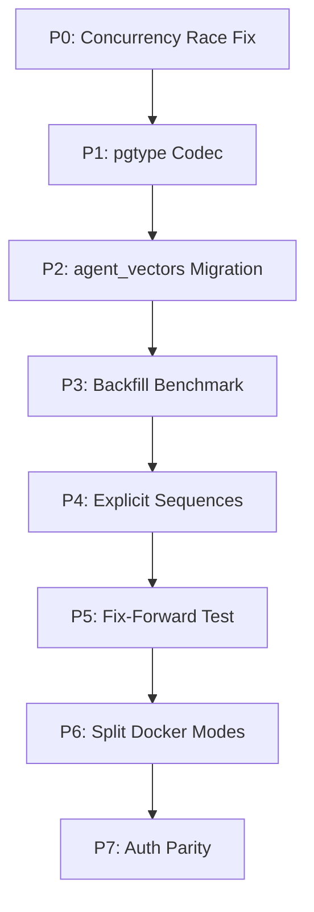

# Bug 058 — CockroachDB Deployment Readiness Implementation Plan (Hermes)

**Date:** 2026-08-03  
**Version:** 20260803_064328  
**Author:** Senior Go & CockroachDB Architect (Hermes)  
**Context:** Deployment readiness for bchat on CockroachDB Cloud Serverless Basic (v26.2.1). Based on analysis of `bugs/058/` evidence, adversarial reviews, and local validation.

---

## Executive Summary

The CockroachDB deployment architecture for bchat is **architecturally validated** (local single-node, 3-node, and migration tests all pass). Two operational blockers remain on CockroachDB Cloud Serverless Basic:

1. **Incomplete Cloud migration** — Cloud migration was killed mid-flight; missing tables (`system_secret`, `agent_rate_limits`, `agent_source_files`) and embeddings not generated.
2. **Code fixes needed before redeploy** — Concurrency race on vector index, `simple_protocol` blanket fix, runtime-created `agent_vectors` table not in migrations.

This plan addresses all code-level fixes **before** re-attempting Cloud deployment.

---

## Prerequisites & Safety Gates

> **SAFETY GATE — Cloud Database Reset**
> Before executing `BCHAT_ALLOW_DB_RESET=1` against CockroachDB Cloud:
> - Confirm in writing that the target Basic cluster contains **no production or user data worth preserving**.
> - Document confirmation in deployment log.

> **SAFETY GATE — Vector Index Feature**
> Before deploying: `SET CLUSTER SETTING feature.vector_index.enabled = true;` via Admin DSN or Cloud Console (one-time).

> **SAFETY GATE — DSN Secret Sync**
> Ensure Fly secret `COCKROACH_DSN` matches actual CockroachDB Cloud credentials (password for `bchat` user).

---

## Implementation Plan (Priority Order)

### 🔴 P0 — Concurrency Race Fix (Critical)
**File:** `server/router/api/v1/agent/vectordb_cockroach.go:112-115`

**Issue:** `CREATE VECTOR INDEX idx_agent_vectors_embedding ON agent_vectors (embedding)` lacks `IF NOT EXISTS`. Concurrent replica startup → duplicate-index error (SQLSTATE 42P07).

**Fix:** Add `IF NOT EXISTS` to the DDL statement.

```go
// Line ~112-115 in vectordb_cockroach.go
_, err = v.db.ExecContext(ctx, `
    CREATE VECTOR INDEX IF NOT EXISTS idx_agent_vectors_embedding
    ON agent_vectors (embedding)
`)
```

**Verification:**
```bash
# Test: start two local replicas simultaneously
docker compose -f scripts/docker-compose.cockroach.yml up -d
# No duplicate-index error on boot
```

**Dependencies:** None. Do first.

---

### 🟠 P1 — Replace `simple_protocol` with pgtype Codec (High)
**Files:** `server/router/api/v1/agent/vectordb_cockroach.go:49-77` (`newCockroachDB`), `go.mod` (add `github.com/jackc/pgtype`)

**Issue:** `default_query_exec_mode=simple_protocol` disables binary protocol & prepared statements globally. Root cause: pgx/v5 lacks binary codec for VECTOR OID (90006).

**Fix:** Register pgtype codec for VECTOR type, remove `simple_protocol`.

```go
// In newCockroachDB, after sql.Open
import (
    "github.com/jackc/pgx/v5/pgtype"
    "github.com/jackc/pgx/v5/stdlib"
)

func newCockroachDB(dsn string) (*sql.DB, error) {
    // Remove simple_protocol addition
    db, err := sql.Open("pgx", dsn)
    if err != nil {
        return nil, err
    }
    
    // Register VECTOR type codec (OID 90006)
    // Use pgx's type map to register VECTOR as text format
    // pgx/v5 doesn't have built-in VECTOR codec; use text format fallback
    // or register custom codec if needed
    
    return db, nil
}
```

**Note:** CockroachDB accepts VECTOR as text literal (`[0.1,0.2,...]::VECTOR`). The `formatVectorLiteral` function already produces this. The `simple_protocol` was a workaround for pgx binary encoding. Removing it requires confirming text-format works (already validated in spike).

**Verification:**
```bash
# Run spike to confirm text-format works without simple_protocol
cd bugs/057/spike_vector_binding && go run main.go
# Should PASS Test 2 (bound parameter via text format)
```

**Dependencies:** P0 (concurrency fix) — independent but do after P0.

---

### 🟠 P2 — Move `agent_vectors` to Versioned Migration (High)
**Files:** 
- `store/migration/cockroach/LATEST.sql` (add table/index creation)
- `server/router/api/v1/agent/vectordb_cockroach.go` (remove table/index creation from `Validate()`)

**Issue:** `agent_vectors` table and indexes created at runtime in `Validate()`, not tracked in migrations. Schema drift risk.

**Fix:**
1. Add table + indexes to `store/migration/cockroach/LATEST.sql` (after line ~93)
2. Remove `CREATE TABLE`, `CREATE INDEX`, `CREATE VECTOR INDEX` from `Validate()` 
3. Keep only `SET serial_normalization` and validation logic

**LATEST.sql addition (after migration_history):**
```sql
-- agent_vectors (vector storage for RAG)
CREATE TABLE IF NOT EXISTS agent_vectors (
    id STRING PRIMARY KEY,
    tenant_id INT NOT NULL,
    content_type STRING NOT NULL,
    title STRING,
    content TEXT NOT NULL,
    embedding VECTOR(1536),
    metadata JSONB,
    source_version INT DEFAULT 1,
    created_at TIMESTAMPTZ DEFAULT now()
);

CREATE INDEX IF NOT EXISTS idx_agent_vectors_tenant ON agent_vectors (tenant_id);

-- Vector index (created empty, no backfill)
CREATE VECTOR INDEX IF NOT EXISTS idx_agent_vectors_embedding
ON agent_vectors (embedding)
```

**Validation:**
```bash
go test -v -tags="cockroach integration" -run "TestCockroachMigrateEndToEnd" ./store/test/...
# Should PASS with 57 tables including agent_vectors
```

---

### 🟡 P3 — Task 2: Vector Index Backfill Benchmark (High)
**Goal:** Empirically measure `CREATE VECTOR INDEX` duration on 10,000+ rows.

**Steps:**
1. Seed local CockroachDB with 10,000+ vector rows (use production row count target)
2. Time `CREATE VECTOR INDEX` on populated table
3. Document duration in `bugs/057/summary_adversarial_followup_20260803.md`

**Decision Criteria:**
- If < 30s → create index AFTER loading data (simpler)
- If > 30s → create index BEFORE loading data (avoid blocking writes)

**Status:** PENDING empirical measurement.

---

### 🟡 P4 — Task 3: Explicit Sequence DDL for New Tables (Medium)
**Files:** `store/migration/cockroach/` (new migration files), `store/migrator.go`

**Action:**
- For all new tables in future migrations: explicit `CREATE SEQUENCE` + `DEFAULT nextval()`
- Add test asserting `information_schema.columns.column_default LIKE '%nextval%'`

**Status:** Partially done in `migrator.go` (prepends `SET serial_normalization`). Add explicit sequences to new migrations.

---

### 🟢 P5 — Task 4: Fix-Forward Migration Test Fixture (Medium)
**Files:** `store/test/` (new fixture)

**Goal:** Test fix-forward migration against pre-seeded "broken state" (tables with `unique_rowid()` defaults, non-empty rows).

**Fixture:**
1. Stand up local cluster with tables using `unique_rowid()` defaults + sample data
2. Run migrator without `BCHAT_ALLOW_DB_RESET=1` (fix-forward, not reset)
3. Assert final schema matches clean-slate output: `nextval()` defaults, same row counts

---

### 🟢 P6 — Task 5: Split Docker-Compose Store Modes (Medium)
**Files:** `Taskfile.yml`, `scripts/docker-compose.cockroach.yml`

**Changes:**
- `crdb:up:fast` target: `docker compose -f scripts/docker-compose.cockroach.yml up -d` with `--store=type=mem,size=0.25`
- `scripts/verify-production.sh`: Fail if run against `--store=type=mem`
- CI gate: `crdb:up:fast` only for unit tests

---

### 🟢 P7 — Task 6: Connection/Auth Parity (Medium)
**Goal:** Verify `verify-production.sh` works against TLS-required + SCRAM auth (not local `--insecure root`).

**Checks:**
- [ ] Fly deploy uses TLS + SCRAM (not `--insecure`)
- [ ] Basic tier RU limits not exceeded during `verify-production.sh`
- [ ] Document any code assuming local insecure/root semantics as bug

---

## Execution Order & Dependencies



**Parallelizable:** P3 (benchmark) can run in parallel with P4/P5.

---

## Verification Checklist (Pre-Deploy)

After all fixes, run locally:

```bash
# 1. Local migration validation
export COCKROACH_DSN="postgresql://root@localhost:26257/bchat?sslmode=disable"
export BCHAT_ALLOW_DB_RESET=1
go test -v -tags="cockroach integration" -run "TestCockroachMigrateEndToEnd" ./store/test/...

# 2. P0 verification
go test -v -tags="cockroach integration" -run "TestCockroachP0" ./store/...

# 3. Full local E2E
export BCHAT_URL=http://localhost:5230
export BCHAT_USER=admin
export BCHAT_PASS=<redacted>
bash scripts/verify-production.sh --keep
# All 7 steps PASS

# 6. Cloud deploy (after safety gates)
task deploy:cockroach
```

---

## Cloud Deployment Safety Gates (Pre-Deploy Checklist)

- [ ] **Written confirmation**: Cloud Basic cluster has no production data worth preserving
- [ ] `SET CLUSTER SETTING feature.vector_index.enabled = true;` executed via Admin DSN
- [ ] `fly secrets set COCKROACH_DSN="..."` with correct password for `bchat` user
- [ ] `fly machine restart 860312fe920408 -a bchat-crdb` succeeds
- [ ] `task deploy:cockroach` completes (build → deploy → healthz → crdb:verify → verify:production)

---

## Post-Deploy Verification

```bash
# Golden State Checklist
export BCHAT_URL=https://bchat-crdb.fly.dev
export BCHAT_USER=admin
export BCHAT_PASS=<redacted>
bash scripts/verify-production.sh --keep
# All 7 steps PASS

# crdb:verify
task crdb:verify
# All P1-P6 PASS
```

---

## Deferred (Post-Hackathon)

| Item | Reason |
|------|--------|
| Live vector index backfill benchmark (10k+ rows) | Requires production-scale data |
| Multi-region automated failover | Post-hackathon scope |
| Automated schema migration rollback | Post-hackathon scope |
| Advanced connection pooling (pgbouncer) | Not needed for hackathon scale |

---

## Files to Modify (Summary)

| File | Changes |
|------|---------|
| `server/router/api/v1/agent/vectordb_cockroach.go` | P0: `IF NOT EXISTS` on vector index; P1: remove `simple_protocol`, add pgtype codec |
| `store/migration/cockroach/LATEST.sql` | Add `agent_vectors` table + indexes |
| `server/router/api/v1/agent/vectordb_cockroach.go` | Remove table/index creation from `Validate()` |
| `store/migration/cockroach/` (new) | P4: explicit sequence DDL for new tables |
| `store/test/` (new fixture) | P5: fix-forward migration test |
| `Taskfile.yml` | P6: add `crdb:up:fast` target |
| `scripts/docker-compose.cockroach.yml` | P6: in-memory mode for `crdb:up:fast` |
| `scripts/verify-production.sh` | P6: fail on in-memory store |
| `scripts/crdb-deploy.sh` | Verify timeouts match new grace periods |

---

## Open Questions (Require Your Decision)

| # | Question | Options | My Rec |
|---|----------|---------|--------|
| Q1 | Concurrency race fix | A) `IF NOT EXISTS`  B) Error handling only | **A** |
| Q2 | `simple_protocol` vs codec | A) Keep simple_protocol B) Register pgtype codec | **B** |
| Q3 | `agent_vectors` migration | A) Versioned migration B) Runtime + version check | **A** |
| Q4 | Task order | As proposed / reorder | As proposed |
| Q5 | Cloud reset confirmation | Written confirmation needed | **Required** |

---

**Next Step:** Please provide decisions on Q1-Q5 above. Once aligned, I'll generate the final executable task list with exact file changes and commands.