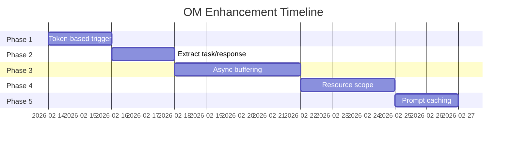

# Observational Memory Enhancement Plan

**Date:** 2026-02-13
**Status:** Planning
**Based on:** [`DOCS_OM_GLM5.MD`](./DOCS_OM_GLM5.MD) gap analysis

---

## Overview

This plan addresses the gaps identified in the OM implementation, prioritized by impact and effort.

---

## Phase 1: Token-Based Observer Trigger (Critical)

### Current State
- Observer triggers after N messages (`OM_MESSAGE_THRESHOLD=10`)
- Inconsistent for verbose vs terse conversations

### Target State
- Observer triggers after N tokens in unobserved messages
- Aligns with Mastra specification (default: 30,000 tokens)

### Implementation Steps

#### 1.1 Add New Configuration Option

**File:** [`server/router/api/v1/agent/om_config.go`](../server/router/api/v1/agent/om_config.go)

```go
type OMConfig struct {
    Enabled                bool
    MessageThreshold       int    // Keep for backward compatibility
    TokenThreshold         int    // For Reflector (existing)
    ObserverTokenThreshold int    // NEW: For Observer trigger
    RetryAttempts          int
    RetryDelayMs           int
}
```

**New Environment Variable:**
- `OM_OBSERVER_TOKEN_THRESHOLD` - Default: 30000 (Mastra default)

#### 1.2 Modify Trigger Logic

**File:** [`server/router/api/v1/agent/service.go`](../server/router/api/v1/agent/service.go)

Replace message count check with token count:

```go
// Current (message-based):
unobservedCount := len(session.Messages) - (lastObservedIdx + 1)
if unobservedCount < omConfig.MessageThreshold {
    return
}

// New (token-based):
unobservedTokens := 0
for i := lastObservedIdx + 1; i < len(session.Messages); i++ {
    unobservedTokens += estimateTokens(session.Messages[i].Content)
}
if unobservedTokens < omConfig.ObserverTokenThreshold {
    slog.Debug("Token threshold not reached", 
        "unobserved_tokens", unobservedTokens,
        "threshold", omConfig.ObserverTokenThreshold)
    return
}
```

#### 1.3 Update Documentation

**File:** [`docs/DOCS_ENV_VAR.MD`](./DOCS_ENV_VAR.MD)

Add new environment variable documentation.

---

## Phase 2: Extract Current Task & Suggested Response (Important)

### Current State
- Observer prompt generates `<current-task>` and `<suggested-response>`
- Code only extracts `<observations>` tag
- Valuable context is discarded

### Target State
- Parse and store current task and suggested response
- Inject into next LLM call for continuity

### Implementation Steps

#### 2.1 Extend ObservationLog Schema

**File:** [`store/agent.go`](../store/agent.go)

```go
type ObservationLog struct {
    SessionID            string
    TenantID             int32
    ObservationLog       string
    LastObservedMsgIndex int
    TokensInLog          int
    CurrentTask          string    // NEW
    SuggestedResponse    string    // NEW
    CreatedAt            time.Time
    LastUpdatedAt        time.Time
}
```

#### 2.2 Update Database Schema

**File:** `store/migration/sqlite/0.25/25__om_enhancements.sql`

```sql
ALTER TABLE agent_observations ADD COLUMN current_task TEXT;
ALTER TABLE agent_observations ADD COLUMN suggested_response TEXT;
```

#### 2.3 Parse Observer Output

**File:** [`server/router/api/v1/agent/observer.go`](../server/router/api/v1/agent/observer.go)

```go
// After parsing observations:
currentTask := parseXMLTag(output, "current-task")
suggestedResponse := parseXMLTag(output, "suggested-response")

obsLog.CurrentTask = currentTask
obsLog.SuggestedResponse = suggestedResponse
```

#### 2.4 Inject into System Prompt

**File:** [`server/router/api/v1/agent/service.go`](../server/router/api/v1/agent/service.go)

```go
// In buildSystemPrompt:
if obsLog.CurrentTask != "" {
    sb.WriteString("\n=== CURRENT TASK ===\n")
    sb.WriteString(obsLog.CurrentTask)
    sb.WriteString("\n")
}
if obsLog.SuggestedResponse != "" {
    sb.WriteString("\n=== SUGGESTED NEXT ACTION ===\n")
    sb.WriteString(obsLog.SuggestedResponse)
    sb.WriteString("\n")
}
```

---

## Phase 3: Async Buffering (Important)

### Current State
- Observer runs synchronously when threshold is reached
- User waits for LLM call to complete

### Target State
- Observations pre-computed in background
- Instant activation when threshold is reached

### Implementation Steps

#### 3.1 Add Buffer Configuration

**File:** [`server/router/api/v1/agent/om_config.go`](../server/router/api/v1/agent/om_config.go)

```go
type OMConfig struct {
    // ... existing fields
    BufferTokens      float64 // Fraction of threshold (0.2 = 20%)
    BufferActivation  float64 // Activation point (0.8 = 80%)
    BlockAfter        float64 // Safety threshold (1.2 = 120%)
}
```

#### 3.2 Create Buffer Manager

**New File:** `server/router/api/v1/agent/observer_buffer.go`

```go
type ObserverBuffer struct {
    mu           sync.RWMutex
    buffers      map[string]*BufferState // sessionID -> state
    triggerChan  chan string
}

type BufferState struct {
    PendingObservations string
    TokenCount          int
    LastBufferTime      time.Time
}
```

#### 3.3 Background Buffer Worker

```go
func (s *Service) startBufferWorker() {
    go func() {
        for sessionID := range s.bufferManager.triggerChan {
            s.runBufferObservation(sessionID)
        }
    }()
}
```

#### 3.4 Modify Trigger Logic

- Check if buffered observations exist
- Activate buffer when threshold reached
- Fall back to sync if buffer not ready

---

## Phase 4: Resource Scope (Enhancement)

### Current State
- Each session has its own observations (thread scope)
- No cross-conversation memory

### Target State
- Optional resource scope for user-level memory
- Share observations across all sessions for a user

### Implementation Steps

#### 4.1 Add Scope Configuration

```go
type OMScope string
const (
    OMScopeThread   OMScope = "thread"
    OMScopeResource OMScope = "resource"
)
```

#### 4.2 Modify Database Schema

```sql
-- Add resource_id column
ALTER TABLE agent_observations ADD COLUMN resource_id TEXT;
CREATE INDEX idx_agent_observations_resource ON agent_observations(resource_id);
```

#### 4.3 Modify Query Logic

- Thread scope: Query by session_id (current behavior)
- Resource scope: Query by resource_id (user_id)

---

## Phase 5: Prompt Caching (Enhancement)

### Current State
- No explicit caching optimization
- Full prompt sent each time

### Target State
- Structure prompt for cache hits
- Use provider caching APIs

### Implementation Steps

#### 5.1 Stable Prompt Structure

```go
// Structure for caching:
// [System Prompt] <- Cacheable
// [Observations]  <- Cacheable (until reflection)
// [Recent Messages] <- Changes frequently
```

#### 5.2 Provider-Specific Caching

```go
// For Anthropic:
type CacheControl struct {
    Type string `json:"type"` // "ephemeral"
}

// For OpenRouter:
type CacheConfig struct {
    UseCache bool `json:"use_cache"`
}
```

---

## Implementation Order



---

## Testing Strategy

### Unit Tests
- Token counting accuracy
- XML parsing for current-task/suggested-response
- Buffer state management

### Integration Tests
- Observer trigger timing
- Cross-session memory (resource scope)
- Cache hit rates

### Manual Verification
- Long conversation simulation
- Multi-user scenarios
- Performance benchmarks

---

## Rollback Plan

Each phase is independently deployable. If issues arise:

1. **Phase 1:** Set `OM_OBSERVER_TOKEN_THRESHOLD=0` to use message count
2. **Phase 2:** Ignore new columns, backward compatible
3. **Phase 3:** Set `BufferTokens=0` to disable buffering
4. **Phase 4:** Default to thread scope
5. **Phase 5:** Disable caching via config

---

## Success Metrics

| Metric | Current | Target |
|--------|---------|--------|
| Observer trigger accuracy | Variable | Consistent (token-based) |
| Agent continuity | Low | High (task tracking) |
| User wait time | ~2-5s | ~0s (async buffering) |
| Cross-session memory | None | Available (resource scope) |
| Token cost | Baseline | -30% (caching) |

---

*Plan created: 2026-02-13*
