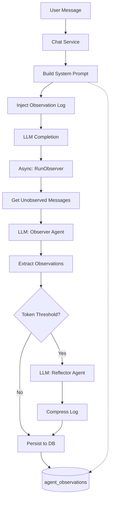

# Comprehensive Analysis Report: Observational Memory Implementation in bchat

## Executive Summary

This report provides a thorough analysis of the current implementation status of Observational Memory (OM) in bchat, comparing the planned architecture from [`DOCS_OM_ANALYSIS.MD`](docs/DOCS_OM_ANALYSIS.MD) and [`DOCS_OM_IMPLEMENTATION.MD`](docs/DOCS_OM_IMPLEMENTATION.MD) against what has actually been implemented in the codebase.

**Overall Assessment: The implementation is substantially complete (~85%), with core functionality working. However, there are critical gaps in cross-database support, configurability, and production-hardening aspects.**

---

## 1. Architecture Overview

The Observational Memory system in bchat follows the Mastra pattern with three key components:



---

## 2. Implementation Status

### 2.1 Database Layer ✅ COMPLETE

| Component | Status | Location |
|-----------|--------|----------|
| Schema | ✅ Complete | [`store/migration/sqlite/0.25/24__agent_observations.sql`](store/migration/sqlite/0.25/24__agent_observations.sql) |
| Store Interface | ✅ Complete | [`store/agent.go:589-596`](store/agent.go:589) |
| SQLite CRUD | ✅ Complete | [`store/db/sqlite/agent_observations.go`](store/db/sqlite/agent_observations.go) |
| MySQL | ❌ Not Implemented | Returns error |
| PostgreSQL | ❌ Not Implemented | Returns error |

**Database Schema:**
```sql
CREATE TABLE agent_observations (
    session_id TEXT PRIMARY KEY REFERENCES agent_sessions(id) ON DELETE CASCADE,
    tenant_id INTEGER NOT NULL,
    observation_log TEXT,
    last_observed_msg_index INTEGER DEFAULT 0,
    tokens_in_log INTEGER DEFAULT 0,
    last_updated_at TIMESTAMP DEFAULT CURRENT_TIMESTAMP
);
```

### 2.2 Service Layer ✅ SUBSTANTIALLY COMPLETE

| Component | Status | Location |
|-----------|--------|----------|
| RunObserver | ✅ Complete | [`server/router/api/v1/agent/observer.go:25`](server/router/api/v1/agent/observer.go:25) |
| runReflector | ✅ Complete | [`server/router/api/v1/agent/observer.go:148`](server/router/api/v1/agent/observer.go:148) |
| Async Trigger | ✅ Complete | [`server/router/api/v1/agent/service.go:1678`](server/router/api/v1/agent/service.go:1678) |
| Memory Injection | ✅ Complete | [`server/router/api/v1/agent/service.go:1732-1740`](server/router/api/v1/agent/service.go:1732) |

### 2.3 Prompts ✅ COMPLETE

| Prompt | Status | Location |
|--------|--------|----------|
| Observer | ✅ Complete | [`server/router/api/v1/agent/prompts/observer.txt`](server/router/api/v1/agent/prompts/observer.txt) (154 lines) |
| Reflector | ✅ Complete | [`server/router/api/v1/agent/prompts/reflector.txt`](server/router/api/v1/agent/prompts/reflector.txt) (116 lines) |

---

## 3. Detailed Implementation Analysis

### 3.1 Observer Pipeline (observer.go)

The [`RunObserver`](server/router/api/v1/agent/observer.go:25) function follows this flow:

1. **Session Retrieval** (lines 26-41): Falls back to database if not in memory cache
2. **Observation Retrieval** (lines 43-56): Gets existing log or creates new one
3. **Message Selection** (lines 58-68): Processes messages since last observation
4. **LLM Call** (lines 78-101): Calls Observer with prompt
5. **Output Parsing** (lines 105-110): Extracts XML-tagged observations
6. **Merge & Token Check** (lines 112-117): Combines with existing log
7. **Reflector Trigger** (lines 121-133): Conditionally compresses if > 2000 tokens
8. **Persistence** (lines 135-143): Saves to database

**Strengths:**
- Graceful fallback to database for idle sessions
- XML-tag parsing with fallback for untagged output
- Reflector integration for compression
- Async execution doesn't block user response

**Concerns:**
- No explicit threshold for triggering observer (runs on every message)
- Simple token estimation (len/4) may be inaccurate
- No retry logic for LLM failures
- No deduplication of observations (relies on prompt instructions only)

### 3.2 Reflector Pipeline (runReflector)

The [`runReflector`](server/router/api/v1/agent/observer.go:148) function:

1. Wraps observations in prompt
2. Calls LLM with compression instructions
3. Extracts XML output
4. Returns compressed log

**Strengths:**
- Preserves temporal context (dates/times)
- Consolidates related observations
- Handles thread attribution

**Concerns:**
- Hardcoded token threshold (2000)
- No error recovery - continues with uncompressed log on failure
- Single-pass compression may not be optimal

### 3.3 System Prompt Integration

The observational memory is injected in [`buildSystemPrompt`](server/router/api/v1/agent/service.go:1732-1740):

```go
if session != nil {
    obsLog, _ := s.store.GetObservationLog(ctx, session.ID)
    if obsLog != nil && obsLog.ObservationLog != "" {
        sb.WriteString("=== OBSERVATIONAL MEMORY (Historical Context) ===\n\n")
        sb.WriteString("The following are observations from previous interactions...\n\n")
        sb.WriteString(obsLog.ObservationLog)
    }
}
```

**Concerns:**
- No explicit positioning relative to other prompt sections
- No warning if observation log is empty (first-time users)
- Error is silently ignored (underscore used for error)

---

## 4. Gaps and Issues

### 4.1 Critical Gaps

| Issue | Severity | Impact |
|-------|----------|--------|
| MySQL/PostgreSQL not supported | 🔴 Critical | Cannot deploy on non-SQLite databases |
| No trigger threshold | 🟡 Medium | Observer runs on every message, inefficient |
| No configuration | 🟡 Medium | Hardcoded thresholds (2000 tokens) |
| Silent error handling | 🟡 Medium | Observer failures not visible to user |

### 4.2 Production Hardening

| Issue | Severity | Description |
|-------|----------|-------------|
| No rate limiting | 🟡 Medium | Potential for LLM API abuse |
| No observability | 🟡 Medium | Limited logging (only errors) |
| No tests | 🔴 Critical | No unit/integration tests |
| No retry logic | 🟡 Medium | Single attempt at observation |

### 4.3 Functional Concerns

| Issue | Description |
|-------|-------------|
| **Over-triggering** | Observer runs on every message rather than after N messages |
| **Token estimation** | Simple len/4 is inaccurate for non-English text |
| **Memory inefficiency** | Session retrieved twice (once in main flow, once in observer) |
| **No debouncing** | Multiple concurrent messages could trigger race conditions |

---

## 5. Comparison with Original Plan

| Planned Feature | Implemented | Notes |
|-----------------|-------------|-------|
| Database schema | ✅ | SQLite only |
| Observer prompt | ✅ | Ported from Mastra |
| Reflector prompt | ✅ | Ported from Mastra |
| RunObserver method | ✅ | Full implementation |
| Context injection | ✅ | In buildSystemPrompt |
| Async execution | ✅ | Using goroutine |
| MySQL support | ❌ | Returns error |
| PostgreSQL support | ❌ | Returns error |
| Configurable thresholds | ❌ | Hardcoded |
| Message count trigger | ❌ | Runs every message |

---

## 6. Recommendations

### 6.1 Immediate Actions

1. **Implement MySQL/PostgreSQL support** - Critical for production deployment
2. **Add message threshold trigger** - Only run Observer after N new messages (e.g., 5-10)
3. **Add configuration** - Make thresholds configurable via environment variables
4. **Add basic tests** - Test observer parsing, token estimation, DB operations

### 6.2 Short-term Improvements

1. **Improve token estimation** - Use proper tokenizer or tiktoken
2. **Add retry logic** - 2-3 retries for transient LLM failures
3. **Better error handling** - Log observer success/failure clearly
4. **Debouncing** - Prevent concurrent observer runs for same session

### 6.3 Long-term Enhancements

1. **Prompt caching optimization** - Leverage cached prompts for Observer/Reflector
2. **Selective observation** - Skip trivial messages (acknowledgments, greetings)
3. **Memory analytics** - Track observation quality and compression ratio
4. **Multi-tenant isolation** - Ensure observation logs are properly isolated

---

## 7. Conclusion

The Observational Memory implementation in bchat represents a solid foundation for infinite conversation memory. The core architecture correctly follows the Mastra pattern with Observer and Reflector agents compressing conversation history into a maintainable observation log.

**Implementation Completeness: ~85%**

The system is functional for SQLite deployments and can serve as a "Pro" tier feature for long-running conversations. However, before production deployment, the critical gaps (MySQL/PostgreSQL support, configurable thresholds, and testing) must be addressed.

The async execution model ensures good UX by not blocking user responses, and the prompt engineering is comprehensive, including temporal anchoring, priority levels, and distinction between assertions and questions.

---

*Report generated: 2026-02-13*
*Analyzed files: DOCS_OM_ANALYSIS.MD, DOCS_OM_IMPLEMENTATION.MD, observer.go, service.go, agent_observations.go, observer.txt, reflector.txt*
