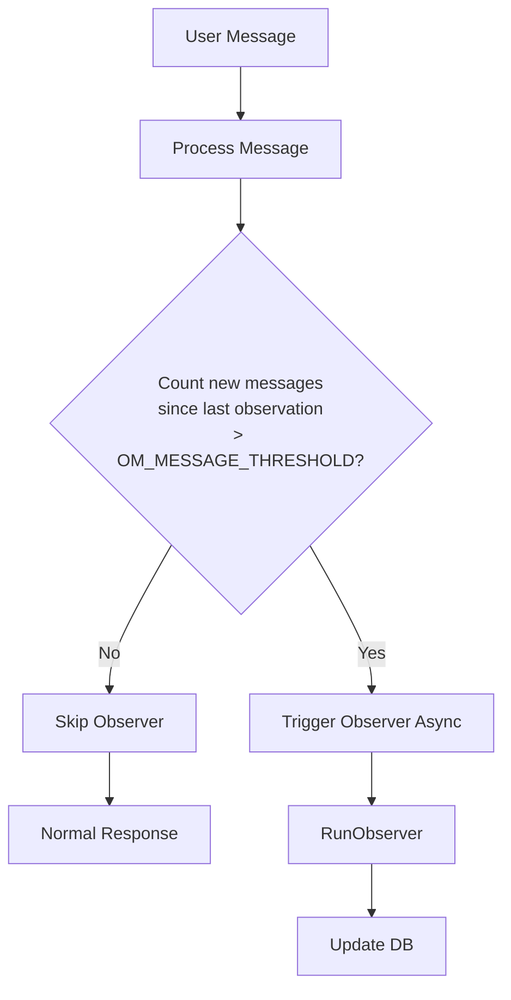
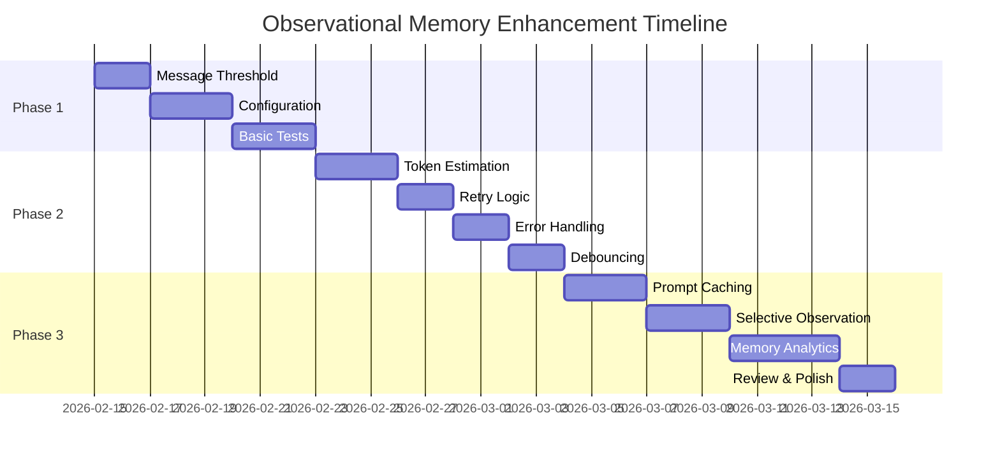

# Observational Memory Implementation Plan

This document outlines the implementation plan for enhancing the Observational Memory (OM) system in bchat based on the gaps identified in [`DOCS_OM_MINIMAX.MD`](docs/DOCS_OM_MINIMAX.MD).

---

## Phase 1: Immediate Actions (High Priority)

### 1.1 Add Message Threshold Trigger

**Problem:** Observer runs on every message, causing unnecessary API calls and costs.

**Current State:** [`service.go:1678`](server/router/api/v1/agent/service.go:1678) triggers Observer on every response.

**Implementation:**



**Files to Modify:**
- [`server/router/api/v1/agent/service.go`](server/router/api/v1/agent/service.go)
- Create new config helper

**Steps:**
1. Add environment variable `OM_MESSAGE_THRESHOLD` with default value of 10
2. Modify the trigger logic in `service.go` to check message count before calling `RunObserver`
3. Read `LastObservedMsgIndex` from the observation log to determine unobserved message count

**Code Changes:**
```go
// In service.go, replace the current trigger:
const defaultMessageThreshold = 10

// Get threshold from env or use default
messageThreshold := getEnvInt("OM_MESSAGE_THRESHOLD", defaultMessageThreshold)

// Check if we have enough new messages
unobservedCount := len(session.Messages) - obsLog.LastObservedMsgIndex - 1
if unobservedCount >= messageThreshold {
    go func() {
        if err := s.RunObserver(context.Background(), session.ID); err != nil {
            slog.Error("Failed to run observer", "session_id", session.ID, "error", err)
        }
    }()
}
```

---

### 1.2 Add Configuration

**Problem:** Thresholds are hardcoded, making it difficult to tune performance.

**Current State:** [`observer.go:122`](server/router/api/v1/agent/observer.go:122) has hardcoded `TokenThreshold = 2000`

**Implementation:**

Create a new configuration file or add to existing config pattern following the existing [`embedding.go`](server/router/api/v1/agent/embedding.go) pattern.

**Files to Create/Modify:**
- Create: `server/router/api/v1/agent/om_config.go`
- Modify: [`server/router/api/v1/agent/observer.go`](server/router/api/v1/agent/observer.go)
- Modify: [`server/router/api/v1/agent/service.go`](server/router/api/v1/agent/service.go)

**Configuration Options:**
| Environment Variable | Default | Description |
|---------------------|---------|-------------|
| `OM_ENABLED` | true | Enable/disable OM system |
| `OM_MESSAGE_THRESHOLD` | 10 | Messages before triggering Observer |
| `OM_TOKEN_THRESHOLD` | 2000 | Tokens before triggering Reflector |
| `OM_RETRY_ATTEMPTS` | 3 | Number of retry attempts for LLM calls |
| `OM_RETRY_DELAY_MS` | 1000 | Delay between retries in milliseconds |

**Code Structure:**
```go
// server/router/api/v1/agent/om_config.go

type OMConfig struct {
    Enabled           bool
    MessageThreshold  int
    TokenThreshold    int
    RetryAttempts     int
    RetryDelayMs      int
}

func NewOMConfig() *OMConfig {
    return &OMConfig{
        Enabled:           os.Getenv("OM_ENABLED") != "false",
        MessageThreshold:  getEnvInt("OM_MESSAGE_THRESHOLD", 10),
        TokenThreshold:    getEnvInt("OM_TOKEN_THRESHOLD", 2000),
        RetryAttempts:     getEnvInt("OM_RETRY_ATTEMPTS", 3),
        RetryDelayMs:      getEnvInt("OM_RETRY_DELAY_MS", 1000),
    }
}
```

---

### 1.3 Add Basic Tests

**Problem:** No tests exist for observer functionality.

**Implementation:**

Create test file following the existing pattern in [`vectordb_test.go`](server/router/api/v1/agent/vectordb_test.go).

**Files to Create:**
- `server/router/api/v1/agent/observer_test.go`

**Test Cases:**

| Test Name | Description |
|-----------|-------------|
| `TestParseXMLTag` | Test XML tag extraction helper |
| `TestParseXMLTag_Multiline` | Test multiline XML parsing |
| `TestEstimateTokens` | Test token estimation accuracy |
| `TestEstimateTokens_Unicode` | Test Unicode text handling |
| `TestOMConfig_Defaults` | Test default configuration values |
| `TestOMConfig_EnvOverrides` | Test environment variable overrides |
| `TestObservationLog_Merge` | Test observation log merging logic |

**Sample Test Code:**
```go
// observer_test.go

func TestParseXMLTag(t *testing.T) {
    tests := []struct {
        name     string
        content  string
        tagName  string
        expected string
    }{
        {
            name:     "simple tag",
            content:  "<observations>test content</observations>",
            tagName:  "observations",
            expected: "test content",
        },
        {
            name:     "multiline content",
            content:  "<observations>\nline 1\nline 2\n</observations>",
            tagName:  "observations",
            expected: "line 1\nline 2",
        },
        {
            name:     "missing tag",
            content:  "no tags here",
            tagName:  "observations",
            expected: "",
        },
    }

    for _, tt := range tests {
        t.Run(tt.name, func(t *testing.T) {
            result := parseXMLTag(tt.content, tt.tagName)
            if result != tt.expected {
                t.Errorf("parseXMLTag() = %q, want %q", result, tt.expected)
            }
        })
    }
}

func TestEstimateTokens(t *testing.T) {
    tests := []struct {
        name     string
        input    string
        expected int
    }{
        {
            name:     "empty string",
            input:    "",
            expected: 0,
        },
        {
            name:     "4 chars = 1 token",
            input:    "test",
            expected: 1,
        },
        {
            name:     "8 chars = 2 tokens",
            input:    "test test",
            expected: 2,
        },
    }

    for _, tt := range tests {
        t.Run(tt.name, func(t *testing.T) {
            result := estimateTokens(tt.input)
            if result != tt.expected {
                t.Errorf("estimateTokens() = %d, want %d", result, tt.expected)
            }
        })
    }
}
```

---

## Phase 2: Short-term Improvements

### 2.1 Improve Token Estimation

**Problem:** Simple `len/4` is inaccurate for non-English text and special characters.

**Current State:** [`observer.go:185-187`](server/router/api/v1/agent/observer.go:185)

**Options:**
1. Use `github.com/pkoukk/tiktoken-go` (OpenAI's tokenizer)
2. Use `github.com/josharian/implate` 
3. Implement cl100k_base encoding

**Recommended Approach:** Use tiktoken for accuracy.

**Implementation:**
```go
// Add to observer.go or new tokenizer.go

import (
    "github.com/pkoukk/tiktoken-go"
    "github.com/revrost/go-openrouter"
)

func countTokens(text string, model string) (int, error) {
    // Use cl100k_base for most models
    encoding, err := tiktoken.GetEncoding("cl100k_base")
    if err != nil {
        return 0, err
    }
    tokens := encoding.Encode(text, nil, nil)
    return len(tokens), nil
}
```

**Files to Modify:**
- [`server/router/api/v1/agent/observer.go`](server/router/api/v1/agent/observer.go)
- `go.mod` (add tiktoken dependency)

---

### 2.2 Add Retry Logic

**Problem:** Single attempt at observation fails silently on transient errors.

**Implementation:**

```go
// Add retry helper function
func withRetry(ctx context.Context, maxAttempts int, delayMs int, fn func() error) error {
    var lastErr error
    for attempt := 1; attempt <= maxAttempts; attempt++ {
        if err := fn(); err != nil {
            lastErr = err
            // Check if retryable
            if !isRetryable(err) {
                return err
            }
            slog.Warn("Observer attempt failed, retrying", "attempt", attempt, "error", err)
            time.Sleep(time.Duration(delayMs) * time.Millisecond)
            continue
        }
        return nil
    }
    return fmt.Errorf("all %d attempts failed: %w", maxAttempts, lastErr)
}

func isRetryable(err error) bool {
    // Network errors, rate limits, etc.
    return true // Simplified - could check error types
}
```

**Files to Modify:**
- [`server/router/api/v1/agent/observer.go`](server/router/api/v1/agent/observer.go)

---

### 2.3 Better Error Handling

**Problem:** Observer failures are only logged, no visibility for operators.

**Implementation:**

1. Add structured logging for success cases
2. Add metrics/observability
3. Consider adding to audit log

```go
// Enhanced logging
slog.Info("Observer completed", 
    "session_id", sessionID, 
    "new_messages", len(newMessages),
    "tokens", tokenCount,
    "reflector_triggered", tokenCount > config.TokenThreshold,
    "duration_ms", time.Since(startTime).Milliseconds())
```

**Files to Modify:**
- [`server/router/api/v1/agent/observer.go`](server/router/api/v1/agent/observer.go)

---

### 2.4 Debouncing

**Problem:** Multiple concurrent messages could trigger race conditions.

**Implementation:**

Use a simple mutex or channel-based debouncer per session:

```go
// In Service struct, add:
type Service struct {
    // ... existing fields
    observerMutex sync.Map // map[string]chan struct{} - per-session mutex
}

// Before running observer:
func (s *Service) tryRunObserver(ctx context.Context, sessionID string) bool {
    lock, _ := s.observerMutex.LoadOrStore(sessionID, make(chan struct{}, 1))
    ch := lock.(chan struct{})
    
    select {
    case ch <- struct{}{}:
        // Acquired lock
        defer func() { <-ch }()
        s.RunObserver(ctx, sessionID)
        return true
    default:
        // Already running, skip
        slog.Debug("Observer already running, skipping", "session_id", sessionID)
        return false
    }
}
```

**Files to Modify:**
- [`server/router/api/v1/agent/service.go`](server/router/api/v1/agent/service.go)

---

## Phase 3: Long-term Enhancements

### 3.1 Prompt Caching Optimization

**Problem:** Observer/Reflector prompts are sent fresh each time.

**Implementation:**

Use OpenRouter's prompt caching feature (if available) or cache prompts locally:

```go
// Add to request
Messages: []openrouter.ChatCompletionMessage{
    {Role: "system", Content: {Type: "text", Text: observerSystemPrompt}},
    {Role: "system", Content: {Type: "text", Text: "<observations>...</observations>", Cache: true}},
    {Role: "user", Content: {Type: "text", Text: userContent}},
}
```

**Files to Modify:**
- [`server/router/api/v1/agent/observer.go`](server/router/api/v1/agent/observer.go)

---

### 3.2 Selective Observation

**Problem:** All messages are observed, including trivial ones.

**Implementation:**

Add a filter to skip certain message types:

```go
// Message types to potentially skip
var trivialPatterns = []string{
    "^ok$",
    "^thanks?$", 
    "^yeah$",
    "^yes$",
    "^no$",
    "^okay$",
    "^sure$",
}

func isTrivialMessage(content string) bool {
    trimmed := strings.TrimSpace(strings.ToLower(content))
    for _, pattern := range trivialPatterns {
        if matched, _ := regexp.MatchString(pattern, trimmed); matched {
            return true
        }
    }
    return false
}
```

**Files to Modify:**
- [`server/router/api/v1/agent/observer.go`](server/router/api/v1/agent/observer.go)

---

### 3.3 Memory Analytics

**Problem:** No visibility into observation quality.

**Implementation:**

Add logging and metrics:

```go
// Track compression ratio
compressionRatio := float64(tokenCountBefore) / float64(tokenCountAfter)
slog.Info("Reflector compression",
    "session_id", sessionID,
    "tokens_before", tokenCountBefore,
    "tokens_after", tokenCountAfter,
    "ratio", compressionRatio)
```

Consider adding a database table for analytics:
- Observation count per session
- Compression ratios
- Observer trigger frequency

---

### 3.4 Multi-tenant Isolation

**Problem:** Ensure observation logs are properly isolated.

**Current State:** Already implemented via `session_id` and `tenant_id` in schema.

**Verification:**

Ensure all queries properly filter by tenant:
```sql
-- In any observation log queries
WHERE session_id = ? AND tenant_id = ?
```

---

## Implementation Order



---

## Summary

This plan addresses all the gaps identified in the original analysis:

| Gap | Phase | Priority |
|-----|-------|----------|
| Message threshold trigger | Phase 1 | High |
| Configuration | Phase 1 | High |
| Basic tests | Phase 1 | High |
| Token estimation | Phase 2 | Medium |
| Retry logic | Phase 2 | Medium |
| Error handling | Phase 2 | Medium |
| Debouncing | Phase 2 | Medium |
| Prompt caching | Phase 3 | Low |
| Selective observation | Phase 3 | Low |
| Memory analytics | Phase 3 | Low |

---

*Plan created: 2026-02-13*
